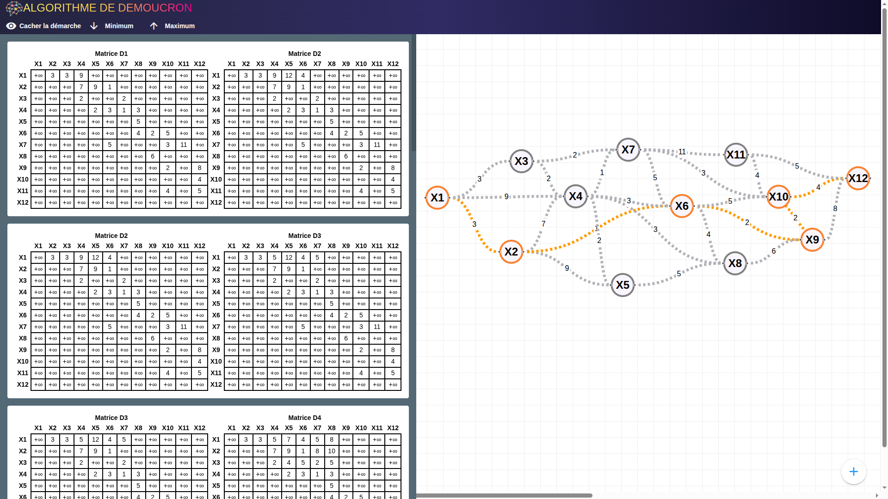

# Demoucron algorithme

> méthode de recherche de chemin optimal dans un graphe, permettant de déterminer le parcours le plus avantageux entre deux sommets en fonction des coûts ou distances associés aux arcs.


---

## 📸 Aperçu



---

## 🧱 Stack technique

| Couche   | Technologie            |
| -------- | ---------------------- |
| Frontend | Vue 3 (Quasar)         |
| DevOps   | Docker, Docker Compose |

---

## 📁 Structure du projet

```
demoucron/
│
│── src/
│── Dockerfile
└── README.md
```

---

## 🚀 Installation & Lancement

### Prérequis

- Git
- Node.js 20+ ou [Docker](https://www.docker.com/)

### 1. Cloner le projet

```bash
git clone git@github.com:Delon-HUB/Demoucron.git
cd Demoucron
```

### 2. Lancer avec Docker

```bash
docker image build -t demoucron
docker run -d --name demoucron -p 8080:80 demoucron:latest
```

---

### 3. Accéder à l'application

http://localhost:8080

---

### 4. Arrêter l'application

```bash
docker stop demoucron
```

## 🛠️ Développement local (sans Docker)

```bash
# Backend
cd demoucron
npm install
npm run dev
```

---

## 👤 Auteur

**Nicolas Delon**

- GitHub : [@Delon-HUB](https://github.com/Delon-HUB)

---
